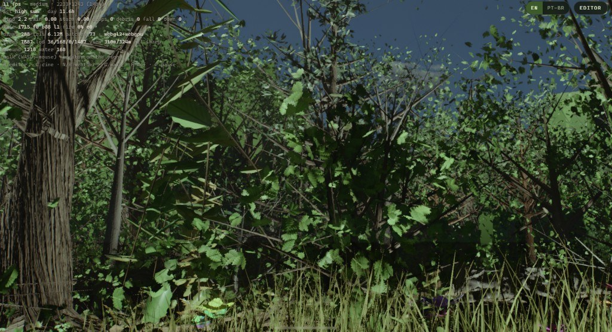
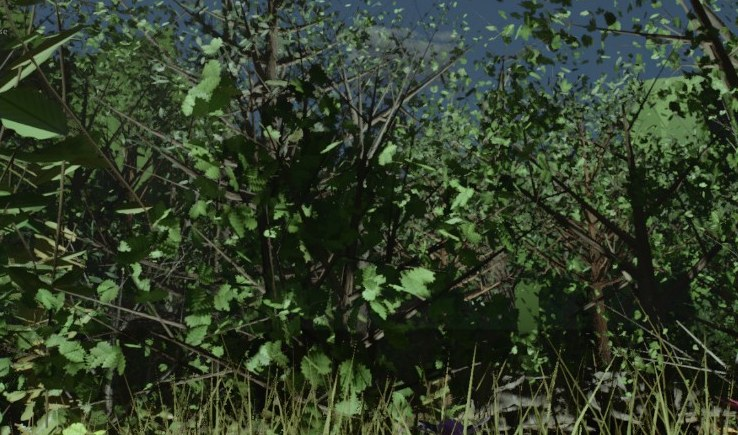
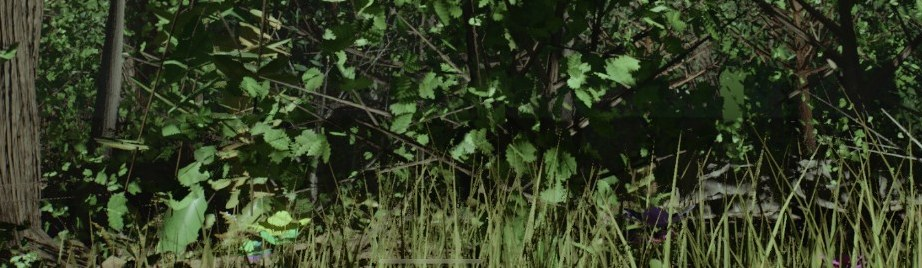
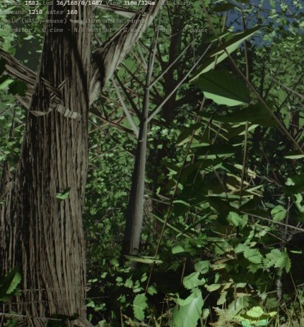
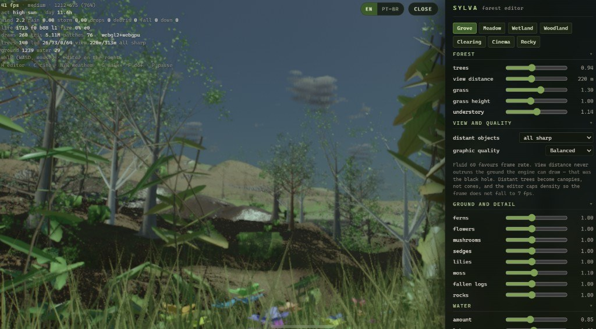
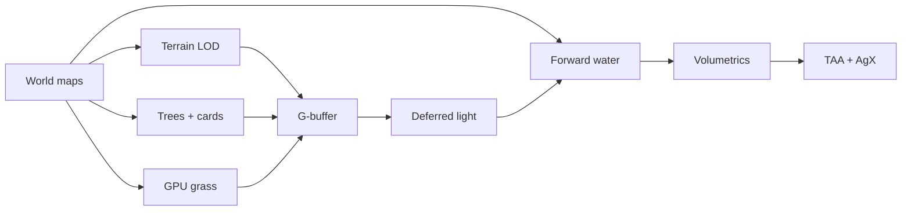

# Sylva

[](https://token-gremlin.github.io/realistic-forest/)
[](LICENSE)
[](https://threejs.org/)
[](#how-it-is-put-together)
[](https://github.com/Token-Gremlin/realistic-forest/stargazers)

**A cinematic forest that exists only as mathematics.**

No textures. No meshes. No HDRIs. No downloaded art of any kind. Terrain,
trees, grass, water, sky, clouds and weather are grown in the browser, live,
from GLSL and a few kilobytes of growth rules.

[**Open the live demo →**](https://token-gremlin.github.io/realistic-forest/)

The default session is a walkable **forest editor** in English (one-click
EN / PT-BR), with named looks, shareable URLs and fair high sun. Storms stay
off until you ask for them.

By [Token Gremlin](https://x.com/TokenGremlin)
· [Português](README.pt-BR.md)
· [How it works](docs/architecture.md)
· [Contributing](CONTRIBUTING.md)

<p align="center">
  
</p>

<p align="center"><em>Walking the Grove. ~1,700 trees in view, 6M+ triangles, WebGL2, no external assets.</em></p>

<p align="center">
  
  
  
</p>

## Why this exists

Most “procedural forests” in the browser are a heightmap, a handful of GLTF
trees, and a texture pack. Sylva is the opposite: **the repository has no
binary art**. A beech is a skeleton grown from a seed. A pond is a Worley
basin whose water line is exactly horizontal. Distant hills stay a forest
because the stream disk is packed before the boot overlay hides, and view
distance is not allowed to outrun the baked ground.

You walk it. You tune it. You share the URL.

<p align="center">
  
</p>

<p align="center"><em>The live studio. Named looks, sliders that write the URL, quality tiers that refuse to spawn seven thousand cones.</em></p>

## Features

| | |
| --- | --- |
| **Fully procedural** | Terrain, bark, foliage, grass, water, sky and weather are functions. Clone the repo and you have the whole world. |
| **Walkable editor** | WASD + mouse. Looks: Grove, Meadow, Wetland, Woodland, Clearing, Cinema, Rocky. Every slider is a query string. |
| **Settled first frame** | `forest.settleView()` packs the opening stand before the overlay hides. Trees do not teleport in. |
| **A horizon that stays a forest** | Mid-mesh while a stem is large on screen; irregular canopy cards past that. Hard instance caps. No cone billboards. |
| **Lake and stream water** | Refraction, screen-space reflection, caustics, foam, wind-driven chop. A missing bed becomes a lake floor — not a black hole or a glowing slab. |
| **Weather as a timeline** | Dawn mist → high sun → storm → night. Opt-in. Fireflies, birds, rain, lightning, falling limbs. |
| **English first** | Default locale is English. EN / PT-BR in the corner. Preference is `?lang=` then `localStorage`. |
| **One runtime dependency** | [Three.js](https://threejs.org/) `^0.185`. Renderer is **WebGL2 + GLSL**. If the browser also exposes WebGPU, that is only a quality hint. |

## Quick start

```bash
git clone https://github.com/Token-Gremlin/realistic-forest.git
cd realistic-forest
npm install
npm run dev        # http://localhost:5173
```

Needs a current desktop browser with **WebGL2** and `EXT_color_buffer_float`.
A discrete GPU is the intended target. Software rasterisers (SwiftShader,
llvmpipe) will boot and are useful for shader-error checks — they are not
beauty proofs.

```bash
npm run build      # static files in dist/
npm run preview    # serve the bundle
```

The same bundle is what GitHub Pages serves as the
[live demo](https://token-gremlin.github.io/realistic-forest/).

## Controls

| Key | Action |
| --- | --- |
| `H` | Show / hide the forest editor |
| `C` | Cinematic camera |
| `N` / `B` | Next / previous weather act (off until you press them) |
| `G` | Walk mode — camera follows the ground |
| `F` | Depth of field |
| `P` | Pause |
| Mouse / WASD / Shift / wheel | Free camera (click to capture the pointer) |

Click the canvas to capture the pointer. `Esc` releases it.

## Looks

The named looks are editor presets, not separate scenes. URL keys stay
stable so a shared link keeps working.

| Look | URL | What you get |
| --- | --- | --- |
| Grove | `?look=bosque` | Temperate clearing, dense at your feet. The default. |
| Meadow | `?look=prado` | Few trees, a lot of grass and flowers. |
| Wetland | `?look=brejo` | Streams, sedges, lilies. |
| Woodland | `?look=mata` | Closed canopy, ferns and moss. |
| Clearing | `?look=clareira` | Open, sunlit, flowers on the floor. |
| Cinema | `?look=cinema` | Golden hour, depth of field, cinematic camera. |
| Rocky | `?look=rochoso` | Little water, stone and pines. |

## URL parameters

| Param | Values |
| --- | --- |
| `?q=` | `tiny` `low` `play` `medium` `high` `ultra` — quality (`play` is default) |
| `?look=` | `bosque` `prado` `brejo` `mata` `clareira` `cinema` `rochoso` |
| `?gfx=` | `fluid` `balanced` `pretty` `max` |
| `?far=` | `full` (sharp horizon) or `blur` |
| `?act=` | Weather act `0`–`11` (see below) |
| `?timeline=1` | Enable the weather timeline |
| `?cine=1` | Start in cinematic camera |
| `?panel=0` | Hide the editor |
| `?lang=` | `en` (default) or `pt-BR` |

The session boots in **high sun** (act 3) with the weather timeline off.
View distance never outruns the baked ground window.

### Weather acts

| # | Act |
| --- | --- |
| 0 | Dawn mist |
| 1 | First light |
| 2 | Morning shafts |
| 3 | High sun *(default)* |
| 4 | Wind rising |
| 5 | Front arriving |
| 6 | Downpour |
| 7 | Severe storm |
| 8 | Breaking up |
| 9 | Golden hour |
| 10 | Blue hour |
| 11 | Night |

Fair weather is the product. Rain on the lens, lightning and falling stems
are there when you turn them on — they are not the greeting.

## How it is put together

```
src/world/     terrain function, world maps, water, sky, Forest orchestrator
src/veg/       tree growth, species, grass, undergrowth
src/core/      WebGL2 deferred pipeline, shadows, quality tiers
src/director/  weather acts, cinematic camera
src/fx/        rain, lightning, fire, birds, debris
src/editor/    live forest studio
src/ui/        English / PT-BR strings and the editor panel
```

A short map of the frame:



The ground is an analytic function of XZ, not a heightmap.
`WorldMaps` bakes a sliding window around the camera (height, water surface,
wetness, flow, canopy, rock…). Everything that needs the ground millions of
times a frame reads those maps. Stretching the last bake across a kilometre
is what used to paint a black slab on the horizon — the far plane is clipped
inside that window on purpose.

Trees grow from a per-seed skeleton (phototropism, pipe-model radii, root
flare). Live LOD is **on-screen height in pixels**, not metres. The coarse
“lego” mesh never goes to colour; mid-mesh gives way to a procedural canopy
card only when the tree is small.

Deeper notes: [docs/architecture.md](docs/architecture.md).

## Performance

The Grove shot above is a real session on a discrete GPU: medium quality,
~2200×1240, on the order of **1.6k–1.7k trees** and **6 million triangles**,
walk camera, fair high sun.

Graphics tiers (`?gfx=`) trade mesh hold distance against frame rate.
`fluid` aims at 60. `balanced` is the editor default. Instance counts are
capped on purpose — an uncapped kilometre of full-mesh trees is how the
frame fell to 7 fps and the horizon turned into cones.

| Tier | Full / mid meshes | Cards | Intent |
| --- | --- | --- | --- |
| Fluid 60 | 22 / 88 | 1800 | Frame rate |
| Balanced | 36 / 168 | 2800 | Default walk |
| Beautiful | 48 / 190 | 3000 | Stills |
| Maximum | 68 / 240 | 3400 | You asked for it |

## Testing

```bash
npm run capture -- --q=tiny --w=960 --h=540 --out=shots/try
```

Headless Chrome (SwiftShader) collects shader compile errors and writes
stills. Pins live in `tools/cap-*.js`. Treat those frames as **logic
checks**, not beauty proofs. The screenshots in this README were taken on
a real GPU.

## Project status

Public, MIT, one runtime dependency. The live demo is the Vite production
build on GitHub Pages. Issues and pull requests are welcome — read
[CONTRIBUTING.md](CONTRIBUTING.md) first (WebGL2 stays, fair-weather boot
stays, no uncapped mesh forests).

## License

[MIT](LICENSE) — © 2026 [Token Gremlin](https://x.com/TokenGremlin).

Three.js is © the [three.js authors](https://github.com/mrdoob/three.js),
also MIT.
